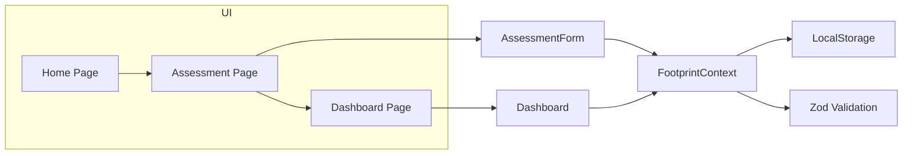

# Architecture

## Overview
EcoSphere is structured as a clean, modular Next.js App Router application with a local-first persistence layer. The architecture separates UI, state, validation, and storage into distinct, testable modules.

## Core Layers

- **App Router** — Application flows are implemented using `src/app/*` routes.
- **Components** — Reusable UI components live under `src/components/`.
- **Hooks** — Business logic and derived state live under `src/hooks/`.
- **Context Providers** — Application state is provided via `src/components/providers/AppProvider.tsx`.
- **Validation Layer** — Zod schemas defined in `src/lib/schemas.ts` enforce data contract rules.
- **Storage Layer** — Local storage operations are handled by `src/lib/utils.ts` and coordinated in the provider.

## Application Flow

1. User lands on the home page.
2. User accesses the assessment page to log a carbon action.
3. The assessment form validates input and dispatches state updates to the provider.
4. The provider persists validated state to localStorage.
5. The dashboard consumes persisted state and generates insights.

## Component Structure

- `src/components/assessment/AssessmentForm.tsx`
  - Handles action entry, preview, validation, and submission.
- `src/components/goals/GoalsPanel.tsx`
  - Manages goal creation, activation, and progress.
- `src/components/challenges/ChallengesPanel.tsx`
  - Displays sustainable challenge tasks.
- `src/components/ui/Header.tsx`
  - Navigation and app header layout.
- `src/components/providers/AppProvider.tsx`
  - Provides application state and dispatch functions for the app.

## Hooks

- `src/hooks/useFootprint.ts`
  - Central footprint hook used by dashboard pages.
  - Computes the carbon breakdown, insights, and pagination.
  - Exposes derived state and normalized data for UI consumption.

## Validation Layer

- `src/lib/schemas.ts`
  - Defines strict Zod schemas for entries, goals, challenges, settings, and local storage envelopes.
  - Ensures runtime validation for persisted and incoming data.

## Storage Layer

- `src/lib/utils.ts`
  - Implements safe local storage helpers, JSON parsing, sanitization, and recovery.
  - Prevents invalid state from corrupting the application.

## Context Provider

- `src/components/providers/AppProvider.tsx`
  - Initializes application state from safe storage.
  - Provides read-only state and dispatch operations.
  - Uses `requestIdleCallback` and debounced writes to minimize storage overhead.

## Architecture Diagram

## Design Principles

- **Separation of concerns** — UI components do not directly manage storage or validation.
- **Single responsibility** — Each module focuses on one area of responsibility.
- **Testable boundaries** — Hook and utility logic are isolated for robust testing.
- **Progressive enhancement** — Local storage ensures offline compatibility and privacy.
