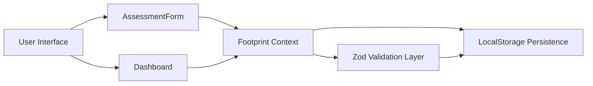

# EcoSphere

**Track. Understand. Reduce. Your Carbon Footprint.**

🚀 **Live Demo:** [https://ecosphere-ashen.vercel.app/](https://ecosphere-ashen.vercel.app/)

[](https://www.typescriptlang.org/)
[](https://nextjs.org/)
[](https://react.dev/)
[](https://tailwindcss.com/)
[](https://vitest.dev/)
[](https://zod.dev/)

## Problem Statement

Individuals want to reduce their carbon footprint, but most solutions are either too complex, too corporate, or too invasive. Without clear, personal visibility into transport, food, energy, and waste emissions, it is difficult to make consistent decisions or measure progress.

EcoSphere solves this problem by turning carbon tracking into a simple, actionable experience while preserving privacy through a local-first architecture.

## Solution

EcoSphere helps users:

- Perform a fast carbon assessment with entry-level actions.
- Track progress using personalized goals.
- Receive contextual recommendations based on their recorded behavior.
- Monitor carbon impact through an intuitive dashboard.
- Engage with sustainable challenges that reinforce better habits.

## Key Features

- **Carbon Footprint Assessment** — Log individual transport, food, energy, and waste actions.
- **Dashboard Analytics** — Visualize carbon breakdowns, trends, and recent activity.
- **Goal Tracking** — Set and manage reduction goals with persistent state.
- **Sustainability Challenges** — Track completed green actions and challenge progress.
- **Personalized Insights** — Receive recommendations tailored to your logged footprint.
- **Local Storage Persistence** — No backend required, no account creation, offline-friendly.
- **Accessibility First Design** — Keyboard navigation, ARIA semantics, and screen reader support.
- **Security Hardened Input Validation** — Zod validation and sanitized storage.
- **Responsive Design** — Mobile-first, performant UI across device sizes.
- **Fast Client-Side Architecture** — Minimal bundle overhead and optimized rendering.

## Architecture Overview

EcoSphere is built on Next.js 15 App Router with React 19 and TypeScript.

```
src/
├── app/
│   ├── assessment/page.tsx
│   ├── dashboard/page.tsx
│   ├── error.tsx
│   ├── layout.tsx
│   ├── not-found.tsx
│   └── page.tsx
├── components/
│   ├── assessment/
│   ├── challenges/
│   ├── goals/
│   ├── providers/
│   └── ui/
├── hooks/
│   └── useFootprint.ts
├── lib/
│   ├── calculator.ts
│   ├── schemas.ts
│   └── utils.ts
├── test/
│   └── setup.ts
└── types/
    └── index.ts
```

### Architecture Diagram



## Security Features

EcoSphere is designed for secure local-first usage:

- **Zod Validation** for all persisted and runtime data.
- **XSS Prevention** through safe input validation and sanitized text.
- **HTML Escaping** of free-form descriptions before storage.
- **Prototype Pollution Protection** in localStorage parsing.
- **Safe Storage Parsing** with versioned envelopes.
- **Corruption Recovery** by replacing invalid payloads with defaults.
- **Secure UUID Generation** using browser crypto APIs.

### Complexity Analysis

- Validation: **O(N)** for string and object validation.
- Storage parsing: **O(V + E)** for nested object cleaning.
- Carbon aggregation: **O(N)** single-pass breakdown computation.

## Accessibility Features

EcoSphere is built with WCAG-aligned design and accessibility best practices:

- **WCAG 2.2 AA goals** for keyboard usability and readable interfaces.
- **Keyboard navigation** for tabs, buttons, and form controls.
- **Screen reader support** through ARIA labels and live regions.
- **Focus management** with visible focus states.
- **Semantic HTML** and landmark roles.
- **ARIA support** for form feedback and tab panels.
- **Color contrast considerations** for readability.

## Performance & Efficiency

EcoSphere prioritizes fast client-side experience:

- **Memoization strategy** with `React.memo`, `useMemo`, and `useCallback`.
- **requestIdleCallback storage writes** to avoid UI jank.
- **O(N) aggregation algorithms** for footprint breakdown.
- **Optimized rendering** via minimal re-renders and stable references.
- **Minimal bundle philosophy** with lightweight dependencies.

| Operation | Time Complexity | Space Complexity |
|---|---|---|
| Carbon breakdown aggregation | O(N) | O(1) |
| Form validation | O(N) | O(1) |
| LocalStorage parse + sanitize | O(V + E) | O(D) |
| Component render updates | O(1) amortized | O(1) |

## Testing Strategy

EcoSphere is validated with an automated testing pipeline:

- **Unit tests** for utilities, calculators, and storage helpers.
- **Integration tests** for form flows and provider behavior.
- **Accessibility tests** using `vitest-axe` and DOM assertions.
- **Security tests** for validation, storage parsing, and sanitization.
- **Edge-case tests** for invalid storage, empty state, and recovery paths.

### Current Test Coverage

- **185+ tests**
- **Coverage enforcement** under `vitest run --coverage`
- **Automated validation** via CI-ready scripts

## Code Quality Standards

### Engineering Principles
- **Strict TypeScript** with `noEmit` type checking.
- **No `any` usage** in business and validation layers.
- **ESLint** powered linting with security awareness.
- **Single Responsibility Principle** for components and utilities.
- **Modular architecture** with clear separation of concerns.
- **Predictable naming conventions** across hooks, contexts, and UI.

## Folder Structure

```bash
/
├── README.md
├── SECURITY.md
├── ARCHITECTURE.md
├── TESTING.md
├── ACCESSIBILITY.md
├── next.config.mjs
├── package.json
├── tsconfig.json
└── src/
    ├── app/
    ├── components/
    ├── hooks/
    ├── lib/
    ├── test/
    └── types/
```

## Installation

```bash
npm install
npm run dev
npm run build
npm run test
npm run lint
npm run type-check
```

## Quality Gates

| Gate | Requirement |
|---|---|
| Type Safety | 100% |
| Test Pass Rate | 100% |
| Accessibility | WCAG Focused |
| Security | Validation Required |
| Linting | Zero Errors |

## CI/CD Pipeline

EcoSphere is configured with continuous integration and continuous deployment pipelines to maintain high code quality and automate releases:

- **GitHub Actions (CI)**: On every push and pull request to the `main` branch, a GitHub workflow automatically runs:
  - Dependency installation (`npm ci`)
  - Strict type checking (`npm run type-check`)
  - Code linting (`npm run lint`)
  - Automated test suite (`npm run test`)
- **Vercel (CD)**: The application is continuously deployed to Vercel. Any pushes to the `main` branch that pass the CI pipeline will trigger an automatic production build and deployment to the live URL.

## PromptWar Evaluation Alignment

| Category | Strategy |
|---|---|
| Code Quality | Strict TypeScript, modular architecture |
| Security | Zod validation, sanitization, safe storage |
| Efficiency | Optimized rendering, memoization |
| Testing | Extensive automated test coverage |
| Accessibility | WCAG-oriented implementation |

## Future Enhancements

- PWA support for offline persistence and installable experience
- Data export/import for portable footprint logs
- Carbon forecasting and trend projection
- Achievement system for sustainable milestones
- Advanced analytics and comparison reporting

## License

MIT License - Copyright (c) 2026 Karthik
